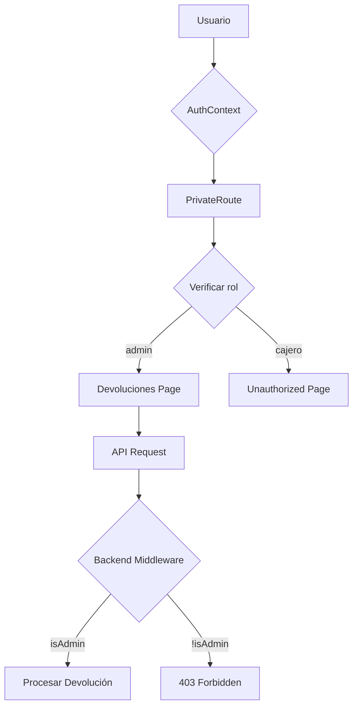
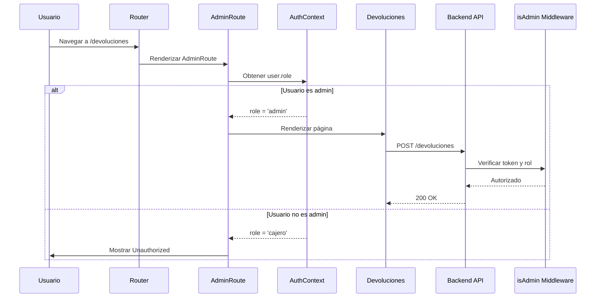

# Documento de Diseño: Restricción de Permisos para Devoluciones

## Resumen

Esta funcionalidad implementa un control de acceso basado en roles para la página de Devoluciones, restringiendo su uso exclusivamente a usuarios con rol de administrador. La solución incluye validación en el frontend (React) mediante componentes de ruta protegida, feedback visual para usuarios no autorizados, y refuerzo de seguridad en el backend mediante middleware de autorización.

El diseño sigue el patrón de seguridad en capas: validación en frontend para UX y validación en backend para seguridad real.

## Arquitectura



## Flujo de Autenticación y Autorización



## Componentes e Interfaces

### Componente 1: AdminRoute

**Propósito**: Componente de orden superior (HOC) que envuelve rutas que requieren permisos de administrador.

**Interface**:
```typescript
interface AdminRouteProps {
  children: React.ReactNode;
  useLayout?: boolean;
}

const AdminRoute: React.FC<AdminRouteProps> = ({ children, useLayout = true }) => {
  // Implementación
}
```

**Responsabilidades**:
- Verificar que el usuario esté autenticado
- Validar que el rol del usuario sea 'admin'
- Redirigir a página de no autorizado si no cumple requisitos
- Renderizar el componente hijo si está autorizado

### Componente 2: Unauthorized

**Propósito**: Página informativa que se muestra cuando un usuario sin permisos intenta acceder a una ruta restringida.

**Interface**:
```typescript
const Unauthorized: React.FC = () => {
  // Implementación
}
```

**Responsabilidades**:
- Mostrar mensaje claro de acceso denegado
- Proporcionar botón para volver al dashboard
- Mantener consistencia visual con el resto de la aplicación

### Componente 3: Layout (Modificación)

**Propósito**: Actualizar el menú de navegación para ocultar el enlace de Devoluciones a usuarios no administradores.

**Modificación**:
```typescript
const menuItems = [
  { path: '/sales', icon: <ShoppingCart size={20} />, label: 'Ventas' },
  { path: '/products', icon: <Package size={20} />, label: 'Productos' },
  { path: '/categories', icon: <Tag size={20} />, label: 'Categorías' },
  { path: '/expenses', icon: <TrendingDown size={20} />, label: 'Gastos' },
  { path: '/suppliers', icon: <Users size={20} />, label: 'Proveedores' },
  { path: '/reports', icon: <Receipt size={20} />, label: 'Reportes' },
  ...(user?.role === 'admin' ? [
    { path: '/devoluciones', icon: <ArrowLeft size={20} />, label: 'Devoluciones' }
  ] : []),
  ...(user?.role === 'admin' ? [
    { path: '/users', icon: <Users size={20} />, label: 'Usuarios' }
  ] : []),
];
```

## Modelos de Datos

### User (Existente)

```typescript
interface User {
  id: number;
  username: string;
  role: 'admin' | 'cajero';
  full_name: string;
  created_at?: string;
}
```

**Reglas de Validación**:
- role debe ser exactamente 'admin' o 'cajero'
- role es inmutable después de la creación (requiere permisos especiales para cambiar)

## Algoritmo de Verificación de Permisos

### Algoritmo Principal: Verificación en Frontend

```typescript
ALGORITHM verifyAdminAccess(user)
INPUT: user of type User | null
OUTPUT: isAuthorized of type boolean

BEGIN
  // Precondición: AuthContext ha cargado el estado de autenticación
  ASSERT loading === false
  
  // Paso 1: Verificar autenticación
  IF user === null OR user === undefined THEN
    RETURN false
  END IF
  
  // Paso 2: Verificar rol de administrador
  IF user.role === 'admin' THEN
    RETURN true
  ELSE
    RETURN false
  END IF
  
  // Postcondición: Retorna true solo si usuario es admin autenticado
  ASSERT (result === true) IMPLIES (user !== null AND user.role === 'admin')
END
```

**Precondiciones**:
- AuthContext ha completado la carga inicial (loading === false)
- user es null o un objeto User válido

**Postcondiciones**:
- Retorna true si y solo si user existe y user.role === 'admin'
- No produce efectos secundarios en el estado de autenticación

**Invariantes**:
- La verificación es idempotente (múltiples llamadas con mismo input producen mismo output)
- No modifica el objeto user

### Algoritmo de Renderizado Condicional

```typescript
ALGORITHM renderAdminRoute(user, loading, children)
INPUT: user (User | null), loading (boolean), children (ReactNode)
OUTPUT: renderedComponent (ReactElement)

BEGIN
  // Paso 1: Mostrar loading mientras se verifica autenticación
  IF loading === true THEN
    RETURN LoadingComponent
  END IF
  
  // Paso 2: Verificar autenticación básica
  IF user === null THEN
    RETURN <Navigate to="/login" />
  END IF
  
  // Paso 3: Verificar permisos de administrador
  IF user.role !== 'admin' THEN
    RETURN <Navigate to="/unauthorized" />
  END IF
  
  // Paso 4: Usuario autorizado, renderizar contenido
  RETURN <Layout>{children}</Layout>
END
```

**Precondiciones**:
- children es un componente React válido
- loading refleja el estado actual de carga de autenticación

**Postcondiciones**:
- Siempre retorna un ReactElement válido
- Redirige apropiadamente según el estado de autenticación y autorización

## Funciones Clave con Especificaciones Formales

### Función 1: AdminRoute Component

```typescript
const AdminRoute: React.FC<AdminRouteProps> = ({ children, useLayout = true }) => {
  const { user, loading } = useAuth();

  if (loading) {
    return (
      <div className="flex items-center justify-center min-h-screen">
        Cargando...
      </div>
    );
  }

  if (!user) {
    return <Navigate to="/login" />;
  }

  if (user.role !== 'admin') {
    return <Navigate to="/unauthorized" />;
  }

  return useLayout ? <Layout>{children}</Layout> : children;
};
```

**Precondiciones**:
- AuthContext está montado y disponible
- children es un componente React válido
- useLayout es un booleano (default: true)

**Postcondiciones**:
- Si loading === true: renderiza pantalla de carga
- Si user === null: redirige a /login
- Si user.role !== 'admin': redirige a /unauthorized
- Si user.role === 'admin': renderiza children con o sin Layout
- No modifica el estado global de autenticación

**Invariantes de Loop**: N/A (no contiene loops)

### Función 2: isAdmin Middleware (Backend)

```typescript
const isAdmin = (req, res, next) => {
  // Precondición: authenticateToken ya ejecutado, req.user existe
  if (req.user.role !== 'admin') {
    return res.status(403).json({ 
      error: 'Acceso denegado. Se requieren permisos de administrador.' 
    });
  }
  next();
};
```

**Precondiciones**:
- req.user existe y fue validado por authenticateToken middleware
- req.user.role es 'admin' o 'cajero'

**Postcondiciones**:
- Si req.user.role === 'admin': llama next() para continuar
- Si req.user.role !== 'admin': retorna 403 con mensaje de error
- No modifica req.user

**Invariantes de Loop**: N/A (no contiene loops)

## Ejemplo de Uso

### Ejemplo 1: Configuración de Rutas en App.jsx

```typescript
import AdminRoute from './components/AdminRoute';
import Unauthorized from './pages/Unauthorized';

function App() {
  return (
    <AuthProvider>
      <Router>
        <Routes>
          <Route path="/login" element={<Login />} />
          <Route path="/unauthorized" element={<Unauthorized />} />
          
          {/* Rutas normales */}
          <Route path="/" element={<PrivateRoute><Dashboard /></PrivateRoute>} />
          <Route path="/sales" element={<PrivateRoute><Sales /></PrivateRoute>} />
          
          {/* Ruta restringida a admin */}
          <Route 
            path="/devoluciones" 
            element={<AdminRoute><Devoluciones /></AdminRoute>} 
          />
          
          <Route path="*" element={<Navigate to="/" />} />
        </Routes>
      </Router>
    </AuthProvider>
  );
}
```

### Ejemplo 2: Protección de Endpoint en Backend

```typescript
const express = require('express');
const router = express.Router();
const { authenticateToken, isAdmin } = require('../middleware/auth');

// Todos los endpoints de devoluciones requieren autenticación Y rol admin
router.post('/', authenticateToken, isAdmin, async (req, res) => {
  // Procesar devolución
});

router.get('/buscar-venta', authenticateToken, isAdmin, async (req, res) => {
  // Buscar venta
});

router.get('/venta/:id', authenticateToken, isAdmin, async (req, res) => {
  // Obtener detalles de venta
});

router.get('/historial', authenticateToken, isAdmin, async (req, res) => {
  // Obtener historial
});

module.exports = router;
```

### Ejemplo 3: Navegación Condicional en Layout

```typescript
const Layout = ({ children }) => {
  const { user } = useAuth();
  
  const menuItems = [
    { path: '/sales', icon: <ShoppingCart />, label: 'Ventas' },
    { path: '/products', icon: <Package />, label: 'Productos' },
    // Solo mostrar Devoluciones a administradores
    ...(user?.role === 'admin' ? [
      { path: '/devoluciones', icon: <ArrowLeft />, label: 'Devoluciones' }
    ] : []),
  ];
  
  return (
    <div>
      <nav>
        {menuItems.map(item => (
          <Link key={item.path} to={item.path}>
            {item.icon} {item.label}
          </Link>
        ))}
      </nav>
      <main>{children}</main>
    </div>
  );
};
```

## Propiedades de Corrección

*Una propiedad es una característica o comportamiento que debe ser verdadero en todas las ejecuciones válidas de un sistema - esencialmente, una declaración formal sobre lo que el sistema debe hacer. Las propiedades sirven como puente entre especificaciones legibles por humanos y garantías de corrección verificables por máquinas.*

### Propiedad 1: Protección de Endpoints Requiere Autenticación y Rol Admin

*Para cualquier* endpoint de devoluciones y cualquier petición HTTP, el sistema debe verificar primero que el usuario esté autenticado mediante token válido, y luego verificar que el rol del usuario sea 'admin' antes de procesar la petición.

**Valida: Requisitos 4.1, 4.2**

### Propiedad 2: Rechazos de Autorización Incluyen Mensaje Descriptivo

*Para cualquier* petición rechazada por falta de permisos, el sistema debe retornar una respuesta que incluya un mensaje descriptivo explicando el motivo del rechazo.

**Valida: Requisitos 4.5, 6.2**

### Propiedad 3: Intentos No Autorizados se Registran en Logs

*Para cualquier* intento de acceso a un endpoint de devoluciones por un usuario sin permisos de administrador, el sistema debe registrar el evento en los logs del servidor incluyendo el nombre de usuario y el rol.

**Valida: Requisito 6.1**

### Propiedad 4: Consistencia Frontend-Backend en Validación

*Para cualquier* usuario autenticado con un token JWT válido, si el componente AdminRoute permite acceso en el frontend, entonces el middleware isAdmin debe permitir acceso en el backend, y viceversa - ambas capas deben usar la misma lógica de verificación basada en el rol del token.

**Valida: Requisitos 7.1, 7.3, 7.4**

### Propiedad 5: Verificación de Permisos es Idempotente sin Efectos Secundarios

*Para cualquier* usuario y cualquier número de verificaciones de permisos, ejecutar la verificación múltiples veces debe producir el mismo resultado en todas las ocasiones, sin modificar el estado del usuario, el objeto de petición, o cualquier otro estado del sistema.

**Valida: Requisitos 8.1, 8.2, 8.3**

## Manejo de Errores

### Escenario 1: Usuario No Autenticado

**Condición**: Usuario intenta acceder a /devoluciones sin token válido

**Respuesta**: 
- Frontend: Redirige a /login
- Backend: Retorna 401 Unauthorized

**Recuperación**: Usuario debe iniciar sesión con credenciales válidas

### Escenario 2: Usuario Cajero Intenta Acceder

**Condición**: Usuario con role='cajero' intenta acceder a /devoluciones

**Respuesta**:
- Frontend: Redirige a /unauthorized con mensaje explicativo
- Backend: Retorna 403 Forbidden si intenta llamar API directamente

**Recuperación**: Usuario debe contactar a un administrador o usar funcionalidades permitidas

### Escenario 3: Token Expirado Durante Operación

**Condición**: Token JWT expira mientras usuario está en página de devoluciones

**Respuesta**:
- Backend: Retorna 403 Token inválido o expirado
- Frontend: Interceptor de API detecta 403 y redirige a /login

**Recuperación**: Usuario debe volver a iniciar sesión

### Escenario 4: Manipulación de Rol en LocalStorage

**Condición**: Usuario malicioso modifica user.role en localStorage

**Respuesta**:
- Frontend: Puede mostrar UI temporalmente
- Backend: Rechaza todas las peticiones (rol en JWT no coincide)
- Retorna 403 con mensaje de error

**Recuperación**: Sistema mantiene seguridad; usuario no puede realizar acciones no autorizadas

## Estrategia de Testing

### Testing Unitario

**Componente AdminRoute**:
- Test 1: Renderiza loading cuando loading=true
- Test 2: Redirige a /login cuando user=null
- Test 3: Redirige a /unauthorized cuando user.role='cajero'
- Test 4: Renderiza children cuando user.role='admin'
- Test 5: Respeta prop useLayout

**Middleware isAdmin**:
- Test 1: Llama next() cuando req.user.role='admin'
- Test 2: Retorna 403 cuando req.user.role='cajero'
- Test 3: Retorna 403 cuando req.user.role es undefined

### Testing de Integración

**Flujo Completo de Autorización**:
- Test 1: Usuario admin puede acceder a /devoluciones y procesar devolución
- Test 2: Usuario cajero no puede acceder a /devoluciones
- Test 3: Usuario no autenticado es redirigido a /login
- Test 4: Token expirado es manejado correctamente

**Navegación Condicional**:
- Test 1: Menú muestra "Devoluciones" solo para admin
- Test 2: Menú oculta "Devoluciones" para cajero
- Test 3: Navegación directa por URL es bloqueada para no-admin

### Testing de Property-Based

**Librería**: fast-check (para JavaScript/TypeScript)

**Propiedad 1: Verificación Idempotente**
```typescript
fc.assert(
  fc.property(
    fc.record({
      id: fc.integer(),
      username: fc.string(),
      role: fc.constantFrom('admin', 'cajero'),
      full_name: fc.string()
    }),
    (user) => {
      const result1 = verifyAdminAccess(user);
      const result2 = verifyAdminAccess(user);
      return result1 === result2;
    }
  )
);
```

**Propiedad 2: Solo Admin Tiene Acceso**
```typescript
fc.assert(
  fc.property(
    fc.record({
      id: fc.integer(),
      username: fc.string(),
      role: fc.constantFrom('admin', 'cajero'),
      full_name: fc.string()
    }),
    (user) => {
      const hasAccess = verifyAdminAccess(user);
      return hasAccess === (user.role === 'admin');
    }
  )
);
```

## Consideraciones de Seguridad

### Defensa en Profundidad

La implementación sigue el principio de defensa en capas:

1. **Capa de UI**: Oculta opciones no disponibles (Layout)
2. **Capa de Routing**: Bloquea navegación no autorizada (AdminRoute)
3. **Capa de API**: Valida permisos en cada request (isAdmin middleware)
4. **Capa de Token**: JWT contiene rol inmutable firmado por servidor

### Prevención de Ataques

**Ataque 1: Manipulación de LocalStorage**
- Mitigación: Backend valida rol desde JWT firmado, no desde localStorage
- LocalStorage solo para UX, no para seguridad

**Ataque 2: Bypass de Frontend**
- Mitigación: Todos los endpoints protegidos con middleware isAdmin
- Frontend es solo primera línea de defensa

**Ataque 3: Token Replay**
- Mitigación: Tokens tienen expiración (24h)
- Considerar implementar refresh tokens para sesiones largas

**Ataque 4: Privilege Escalation**
- Mitigación: Rol en JWT es inmutable sin re-autenticación
- Cambios de rol requieren nuevo login

### Auditoría

Considerar agregar logging de intentos de acceso no autorizado:
```typescript
if (req.user.role !== 'admin') {
  console.warn(`Intento de acceso no autorizado a devoluciones por usuario ${req.user.username} (${req.user.role})`);
  return res.status(403).json({ error: 'Acceso denegado' });
}
```

## Consideraciones de Performance

### Impacto Mínimo

La verificación de roles es una operación O(1):
- Lectura de propiedad user.role desde contexto (ya en memoria)
- Comparación de strings
- Sin llamadas a base de datos adicionales

### Optimizaciones

1. **Memoización de Verificación**: No necesaria (operación ya es instantánea)
2. **Lazy Loading**: Componente Unauthorized puede cargarse bajo demanda
3. **Cache de Menú**: menuItems puede memoizarse con useMemo

```typescript
const menuItems = useMemo(() => [
  { path: '/sales', icon: <ShoppingCart />, label: 'Ventas' },
  ...(user?.role === 'admin' ? [
    { path: '/devoluciones', icon: <ArrowLeft />, label: 'Devoluciones' }
  ] : []),
], [user?.role]);
```

## Dependencias

### Frontend
- react-router-dom (ya instalado): Para navegación y componente Navigate
- lucide-react (ya instalado): Para iconos en página Unauthorized
- AuthContext (existente): Para acceso a estado de autenticación

### Backend
- jsonwebtoken (ya instalado): Para verificación de tokens JWT
- express (ya instalado): Framework web
- middleware/auth.js (existente): Middleware isAdmin ya disponible

### Nuevos Archivos a Crear
- frontend/src/components/AdminRoute.jsx
- frontend/src/pages/Unauthorized.jsx

### Archivos a Modificar
- frontend/src/App.jsx (actualizar ruta de devoluciones)
- frontend/src/components/Layout.jsx (condicionar menú)
- backend/routes/devoluciones.js (agregar middleware isAdmin)
